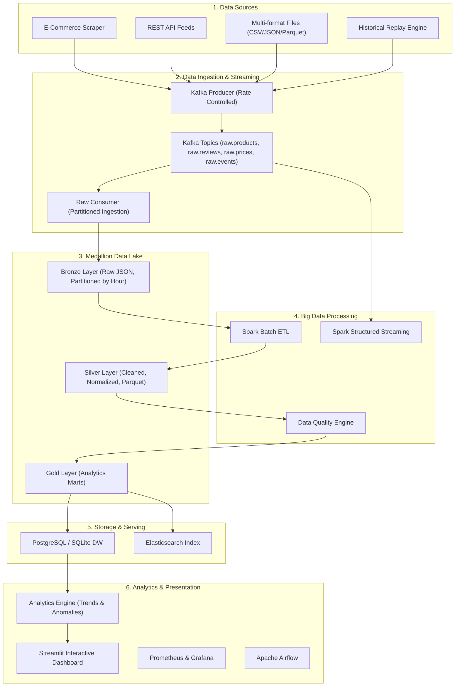

# SentinelAI — Agentic Multimodal Big Data Intelligence Platform

## Phase 1 Status: Under Active Development

### ✅ Completed
- [x] Schema design & data contracts (JSON Schema validation)
- [x] Multi-format data ingestion (CSV, JSON, JSONL, Parquet)
- [x] E-commerce crawler ecosystem (Tiki, Universal, Mock)
- [x] Kafka real producer with message envelope (event_id, event_type, source, ingested_at, payload)
- [x] Kafka consumer with manual offset commit and DLQ
- [x] MinIO storage backend with local fallback
- [x] Batch ETL pipeline (Clean -> Normalize -> Deduplicate -> Validate)  
- [x] Price pipeline
- [x] Gold analytics marts (product_daily_stats, brand_daily_stats, category_daily_stats, price_daily_stats)
- [x] PostgreSQL warehouse with UPSERT
- [x] Spark Structured Streaming (windowed aggregation with watermark)
- [x] Anomaly detection (Review Burst, Price Anomaly, Rating Drop)
- [x] Data Quality evaluator with per-rule metrics
- [x] Streamlit dashboard
- [x] 3V Benchmark suite
- [x] Airflow DAG orchestration
- [x] 65+ unit tests passing

### 🔄 Infrastructure Requirements  
- Docker Compose with Kafka (KRaft), MinIO, Spark, PostgreSQL, Elasticsearch
- `pip install -r requirements.txt`

### Architecture



## 🚀 Quickstart Guide

### 1. Prerequisites & Environment
```bash
# Clone the repository
git clone https://github.com/ptdbrain/Agentic_Multimodal_Big_Data_Intelligence_Platform.git
cd Agentic_Multimodal_Big_Data_Intelligence_Platform

# Install Python requirements
pip install -r requirements.txt
```

### 2. Run the End-to-End Pipeline
Executes data generation, Bronze ingestion, Spark batch ETL, Data Quality evaluation, Anomaly Detection, and Gold DW sync in one command:
```bash
python scripts/run_e2e_pipeline.py
```

### 3. Launch Interactive Streamlit Dashboard
```bash
streamlit run dashboard/app.py
```

### 4. Run Test Suite
```bash
pytest -v
```

## 👥 Author
**PTDBrain** — *phandat20052009@gmail.com*
