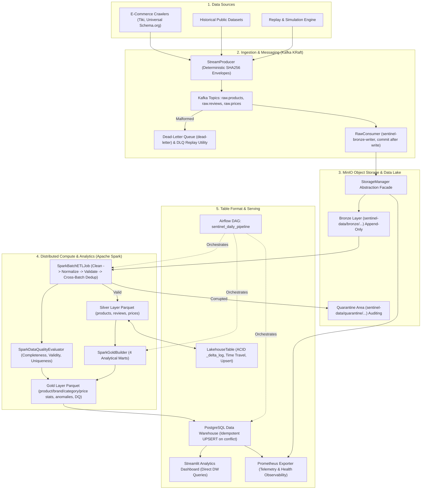
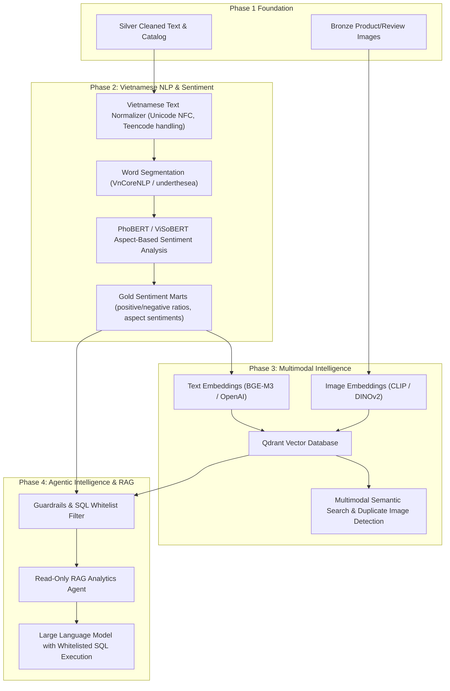

# SentinelAI Architecture Documentation

This document describes the **Current Architecture (Phase 1 Complete)** and the **Target Architecture (Phase 2+ Future Roadmap)** for SentinelAI.

---

## 1. Current Architecture (Phase 1 Production Data Foundation)

### Architectural Highlights of Phase 1:
1. **Deterministic Message Envelopes:** Every event contains an immutable `event_id` computed via `sha256(source|entity_id|event_time)`.
2. **At-Least-Once Kafka Delivery:** `RawConsumer` only commits Kafka offsets after atomic write confirmation to MinIO.
3. **Cross-Batch Deduplication:** `SparkBatchETLJob` merges incoming records with the existing Silver layer via primary keys, guaranteeing idempotency.
4. **Data Quarantine:** Defective records are routed to `quarantine/` with error metadata, preventing silent drops and pipeline poisoning.
5. **Lakehouse Table Format:** ACID commit metadata logged in `_delta_log/*.json`, enabling time-travel audits and atomic merge upserts.
6. **No-Hardcoding Serving:** Streamlit and Prometheus query the Data Warehouse dynamically.

---

## 2. Target Architecture (Phase 2+ AI & Multimodal Roadmap)

