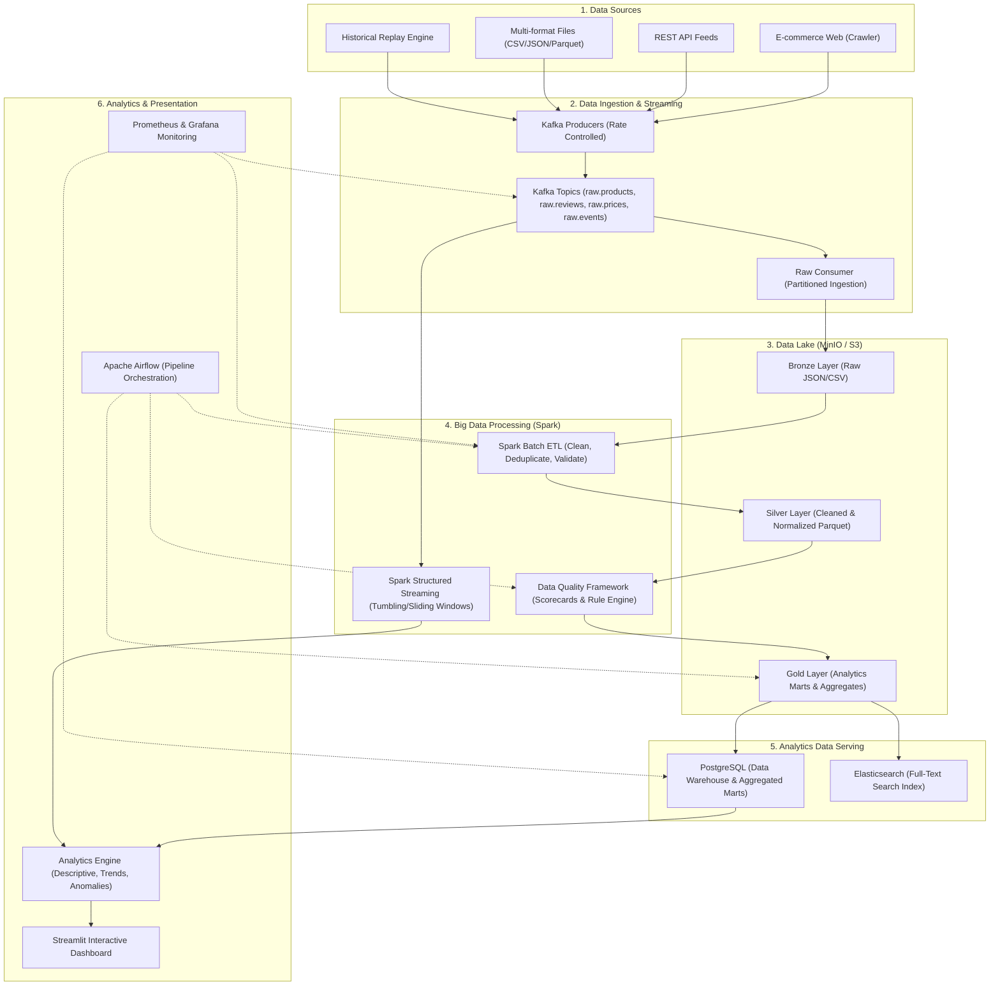

# SentinelAI — Data Foundation & Analytics (Phase 1)

## 1. System Vision & Architecture
SentinelAI is a high-throughput, enterprise-scale Big Data intelligence platform designed to ingest, process, validate, analyze, and monitor multimodal e-commerce data. Phase 1 focuses exclusively on the foundational data engineering and analytics pipeline, establishing an elastic infrastructure for downstream AI/ML extensions.

## 2. The 3V Big Data Principles
- **Volume**: Capable of processing 100K to 1M+ records through distributed partitioning across Bronze, Silver, and Gold Parquet layers.
- **Velocity**: Streaming ingestion with rates ranging from 10 to 500+ messages/sec via Kafka and Spark Structured Streaming with sliding/tumbling windows.
- **Variety**: Ingestion of multi-structured datasets across CSV, JSON, Parquet, relational schemas, and time-series event streams.

## 3. Medallion Data Lake Strategy
- **Bronze (Raw)**: Unaltered historical records stored with partition keys `year=YYYY/month=MM/day=DD/hour=HH`.
- **Silver (Cleaned & Validated)**: Cleaned, schema-validated, normalized, and deduplicated records in columnar Parquet format.
- **Gold (Aggregated Marts)**: Dimensional models (`product_daily_stats`, `brand_daily_stats`, `anomaly_events`) optimized for low-latency BI queries.
